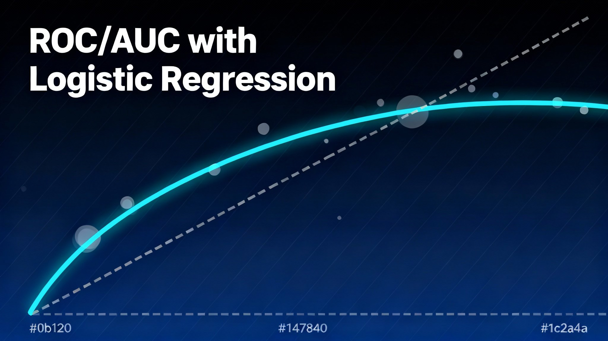

# ROC/AUC Analysis with Logistic Regression (Heart Disease)



A beginner-friendly, end-to-end notebook that explains and demonstrates ROC/AUC analysis using only Logistic Regression on a heart disease dataset.

Repository: https://github.com/arad1367/ROC_AUC  
Data source (CSV): https://raw.githubusercontent.com/arad1367/WAC_November-2023/refs/heads/main/heart.csv  
Contact: pejman.ebrahimi77@gmail.com

## Table of Contents
- Overview
- Files
- Quick Start
- What’s Inside the Notebook
- Results You Can Expect
- Choosing a Threshold
- Calibration
- Notes and Tips
- License

## Overview
This project teaches ROC/AUC from first principles:
- Start with TP/TN/FP/FN and the confusion matrix
- Build to TPR/FPR, ROC curve, and AUC
- Show how to pick thresholds (Youden’s J and cost-sensitive)
- Check probability calibration and uncertainty (bootstrap CI)

All examples use Logistic Regression and are kept deliberately simple for clarity.

## Files
- ROC_AUC.ipynb — main notebook (theory + code)
- banner.png — top banner for this README (place at repo root)
- images/ (optional) — exported figures (e.g., ROC plots)

## Quick Start
You can run the notebook in Colab or locally.

- Colab:
  - Open ROC_AUC.ipynb in Google Colab.
  - The notebook loads the dataset directly from:
    https://raw.githubusercontent.com/arad1367/WAC_November-2023/refs/heads/main/heart.csv

- Local:
  - Python 3.9+ recommended
  - Install packages:
    ```
    pip install numpy pandas scikit-learn matplotlib seaborn scipy
    ```
  - Launch:
    ```
    jupyter notebook ROC_AUC.ipynb
    ```

## What’s Inside the Notebook
- Theory (beginner-friendly):
  - TP/TN/FP/FN and confusion matrix
  - TPR, FPR, ROC curve
  - AUC intuition and interpretation
  - Thresholding (Youden’s J and cost-sensitive)
- Practice (Logistic Regression only):
  - Train/test split (stratified)
  - ROC curve + AUC
  - Youden’s J threshold with confusion matrix
  - Cost-sensitive threshold example
  - Precision–Recall curve (for comparison)
  - Calibration curve (probability quality)
  - Bootstrap AUC confidence interval
  - Cross-validated AUC (out-of-fold)

## Results You Can Expect
- AUC that summarizes ranking performance
- A data-driven threshold (Youden’s J)
- A cost-aware threshold (when FN > FP)
- Calibration insights (whether probabilities are trustworthy)
- Plots ready to export for reports/slides

## Choosing a Threshold
- 0.5 is arbitrary. Prefer data-driven choices:
  - Youden’s J for balanced sensitivity/specificity
  - Cost-sensitive when missing positives is more costly than false alarms
- Always show the confusion matrix at the chosen threshold.

## Calibration
- ROC/AUC measures ranking, not probability accuracy.
- If you use probabilities for decisions, check calibration.
- Consider CalibratedClassifierCV (sigmoid/isotonic) on a held-out set.

## Notes and Tips
- Avoid leakage: fit preprocessing and model on the training split (pipelines help).
- Prefer cross-validated AUC when dataset is modest.
- Report uncertainty with bootstrap CI or CV variability.

## License
Add your preferred license (e.g., MIT) in a LICENSE file.
